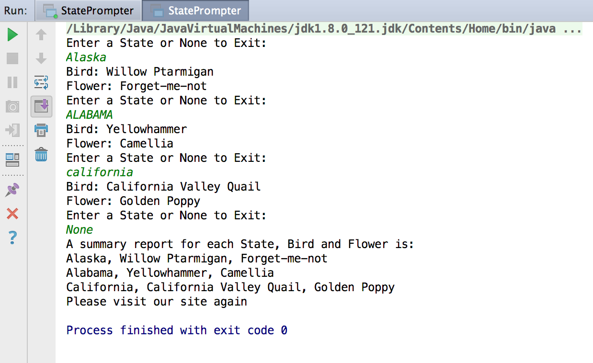
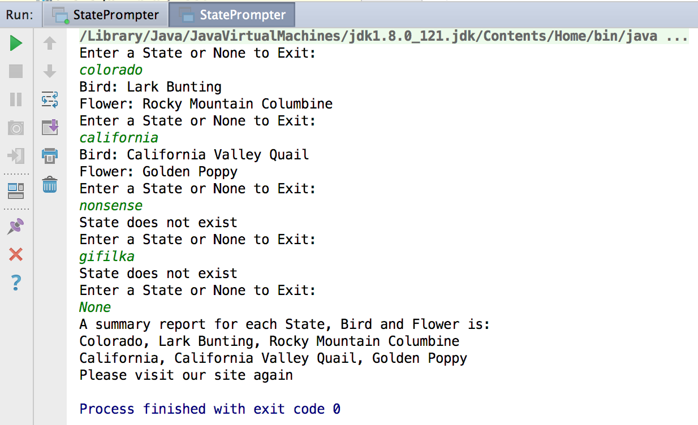
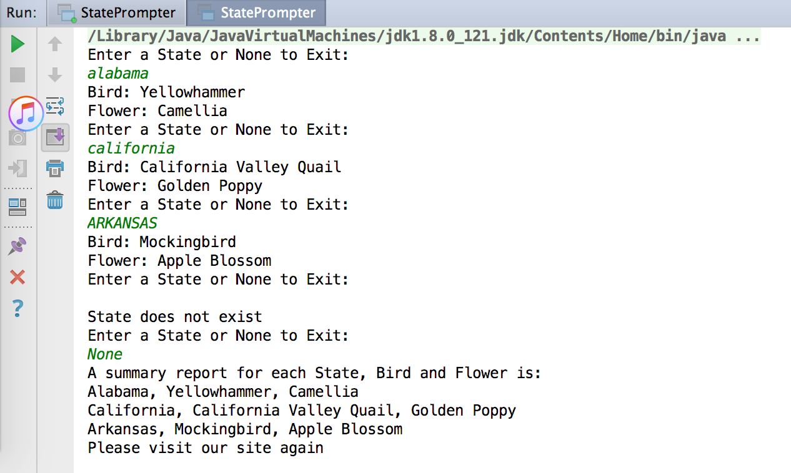

# Homework 4

## Setup
> States were created using the following code:

```java
hmap.put("alabama", new State("Alabama", "Yellowhammer", "Camellia"));
hmap.put("alaska", new State("Alaska", "Willow Ptarmigan", "Forget-me-not"));
hmap.put("arizona", new State("Arizona", "Cactus Wren", "Saguaro Cactus"));
hmap.put("arkansas", new State("Arkansas", "Mockingbird", "Apple Blossom"));
hmap.put("california", new State("California", "California Valley Quail", "Golden Poppy"));
hmap.put("colorado", new State("Colorado", "Lark Bunting", "Rocky Mountain Columbine"));
```

## Test Case 1 - passed

### Inputs

```
"Alaska" > "ALABAMA" > "california" > "None"
```

### Expected Output
```
Enter a State or None to Exit:
Alaska
Bird: Willow Ptarmigan
Flower: Forget-me-not
Enter a State or None to Exit:
ALABAMA
Bird: Yellowhammer
Flower: Camellia
Enter a State or None to Exit:
california
Bird: California Valley Quail
Flower: Golden Poppy
Enter a State or None to Exit:
None
A summary report for each State, Bird and Flower is:
Alaska, Willow Ptarmigan, Forget-me-not
Alabama, Yellowhammer, Camellia
California, California Valley Quail, Golden Poppy
Please visit our site again
```

### Actual Output
```
Enter a State or None to Exit:
Alaska
Bird: Willow Ptarmigan
Flower: Forget-me-not
Enter a State or None to Exit:
ALABAMA
Bird: Yellowhammer
Flower: Camellia
Enter a State or None to Exit:
california
Bird: California Valley Quail
Flower: Golden Poppy
Enter a State or None to Exit:
None
A summary report for each State, Bird and Flower is:
Alaska, Willow Ptarmigan, Forget-me-not
Alabama, Yellowhammer, Camellia
California, California Valley Quail, Golden Poppy
Please visit our site again
```
### Screenshot


## Test Case 2 - Passed

### Inputs

```
"colorado" > "california  " > "nonsense" > "gifilka" > "None"
```

### Expected Output
```
Enter a State or None to Exit:
colorado
Bird: Lark Bunting
Flower: Rocky Mountain Columbine
Enter a State or None to Exit:
california  
Bird: California Valley Quail
Flower: Golden Poppy
Enter a State or None to Exit:
nonsense
State does not exist
Enter a State or None to Exit:
gifilka
State does not exist
Enter a State or None to Exit:
None
A summary report for each State, Bird and Flower is:
Colorado, Lark Bunting, Rocky Mountain Columbine
California, California Valley Quail, Golden Poppy
Please visit our site again
```

### Actual Output
```
Enter a State or None to Exit:
colorado
Bird: Lark Bunting
Flower: Rocky Mountain Columbine
Enter a State or None to Exit:
california  
Bird: California Valley Quail
Flower: Golden Poppy
Enter a State or None to Exit:
nonsense
State does not exist
Enter a State or None to Exit:
gifilka
State does not exist
Enter a State or None to Exit:
None
A summary report for each State, Bird and Flower is:
Colorado, Lark Bunting, Rocky Mountain Columbine
California, California Valley Quail, Golden Poppy
Please visit our site again
```

### Screenshot



## Test Case 3 - Passed

### Inputs

```
"alabama" > "california" > "ARKANSAS" > "" > "None"
```

### Expected Output
```
Enter a State or None to Exit:
alabama
Bird: Yellowhammer
Flower: Camellia
Enter a State or None to Exit:
california
Bird: California Valley Quail
Flower: Golden Poppy
Enter a State or None to Exit:
ARKANSAS
Bird: Mockingbird
Flower: Apple Blossom
Enter a State or None to Exit:

State does not exist
Enter a State or None to Exit:
None
A summary report for each State, Bird and Flower is:
Alabama, Yellowhammer, Camellia
California, California Valley Quail, Golden Poppy
Arkansas, Mockingbird, Apple Blossom
Please visit our site again
```

### Actual Output
```
Enter a State or None to Exit:
alabama
Bird: Yellowhammer
Flower: Camellia
Enter a State or None to Exit:
california
Bird: California Valley Quail
Flower: Golden Poppy
Enter a State or None to Exit:
ARKANSAS
Bird: Mockingbird
Flower: Apple Blossom
Enter a State or None to Exit:

State does not exist
Enter a State or None to Exit:
None
A summary report for each State, Bird and Flower is:
Alabama, Yellowhammer, Camellia
California, California Valley Quail, Golden Poppy
Arkansas, Mockingbird, Apple Blossom
Please visit our site again
```

### Screenshot

